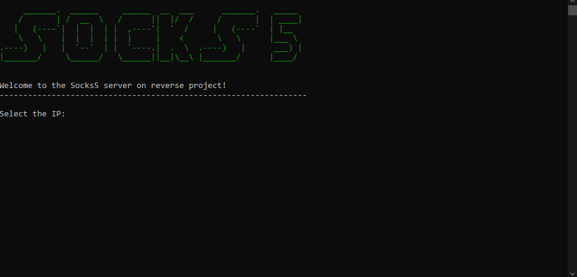
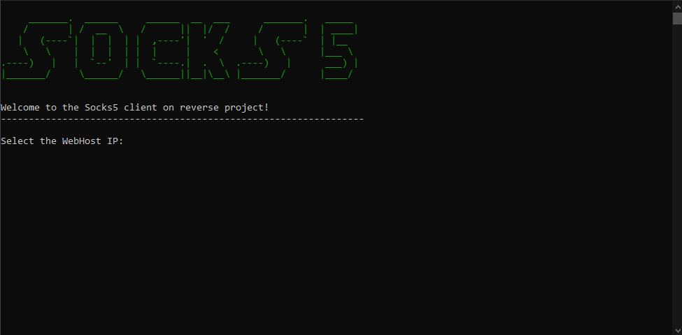

   
# SharpSocks5

## 

#### Tunnellable HTTP/HTTPS socks5 proxy written in C#

## Functionality
- CONNECT X'01' Compatible
- UDP ASSOCIATE X'03' Compatible

## Authentication
- X'00' NO AUTHENTICATION REQUIRED Compatible
- X'01' GSSAPI Compatible
- X'02' USERNAME/PASSWORD Compatible

## Server usage
The server is written in .NET core 3.1. It use a http WebHost, to handle the HTTP traffic.

## Client usage
The client is .NET 3.5 and 4.0 compatible. By default is running on 3.5

